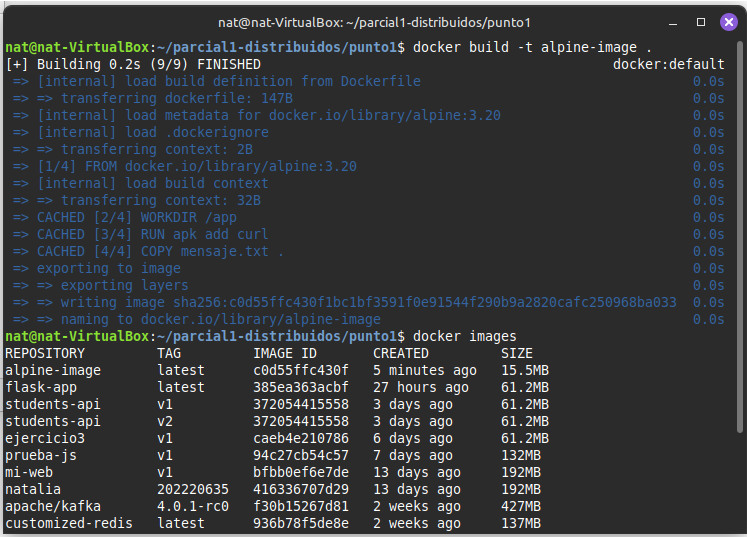
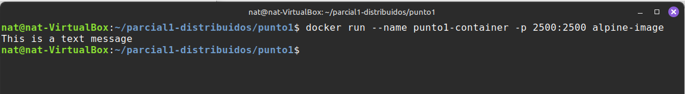
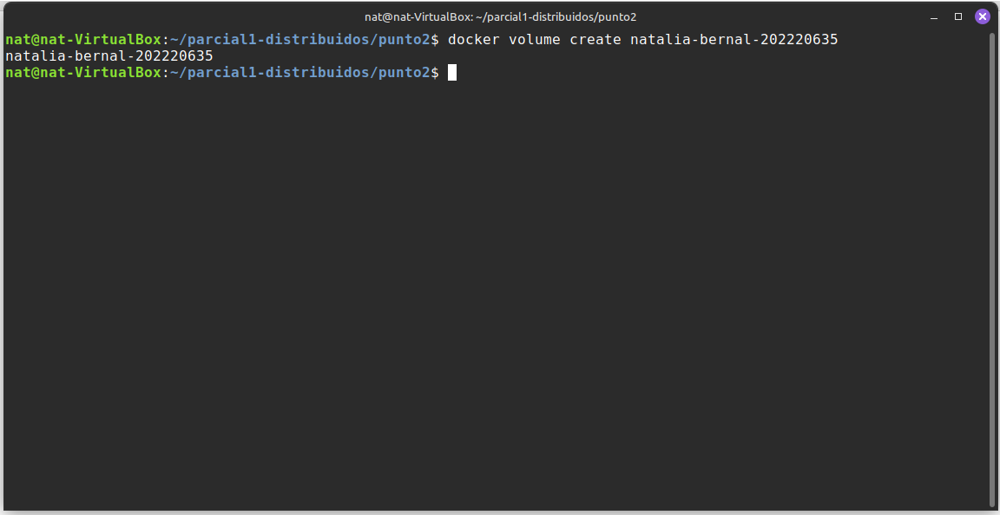
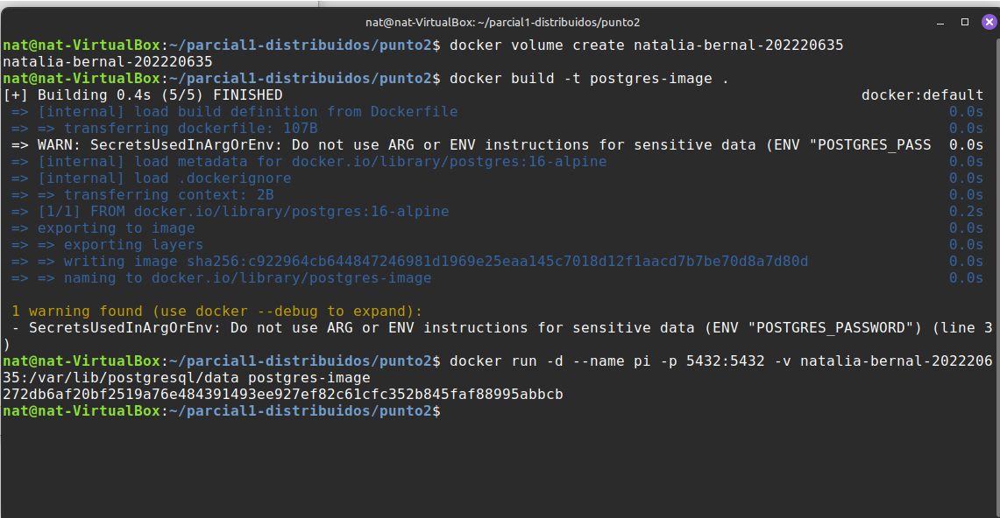
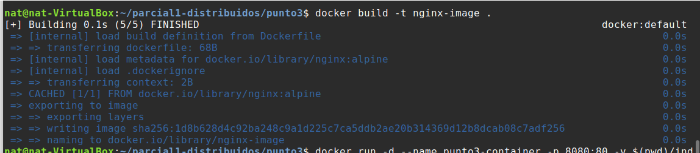
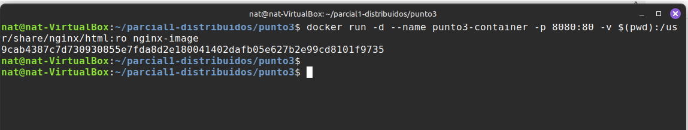
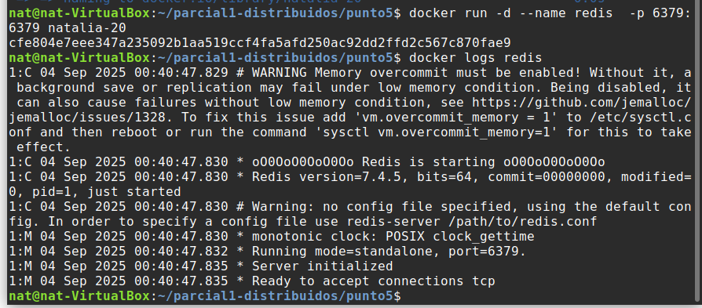

# Parcial 1

## Punto 1

Primero se compiló la imagen con docker run y con docker images se comprobó que ya existiera como imagen


Se ejecutó un contenedor de la imagen recien creada


## Punto 2





## Punto 3





## Punto 4

En este caso el contenedor muere cuando cumple lo que se le pidio con cmd que en este caso es abrir mensaje.txt, como se muestra a continuación:

Los comandos que se usarían si no se terminara el proceso son:

```bash
docker run -d --name prueba  -p 2500:2500 alpine-image
docker exec -it prueba sh -lc 'echo "note test" > notas.txt' #Crearía en el contenedor el archivo notas.txt
docker exec -it prueba sh -c 'pwd' # Mostraria el directorio actual
docker exec -it prueba sh -c 'ls -la' # Mostraria la lista de archivos del directorio actual
docker stop prueba && docker rm prueba #para y elimina el contenedor
docker run -d --name prueba2  -p 2500:2500 alpine-image #crea otro contenedor con la misma imagen
docker exec -it prueba sh -c 'ls -la' # Mostraria la lista de archivos del directorio actual del nuevo contenedor
```

En este caso lo que debería ocurrir es que notas.txt no aparezca en el nuevo contenedor pues no se peristió con un volumen y los cambios que se hicieron durante su ejecución se borraron cuando se detuvo y eliminó el primer contenedor

## Punto 5



